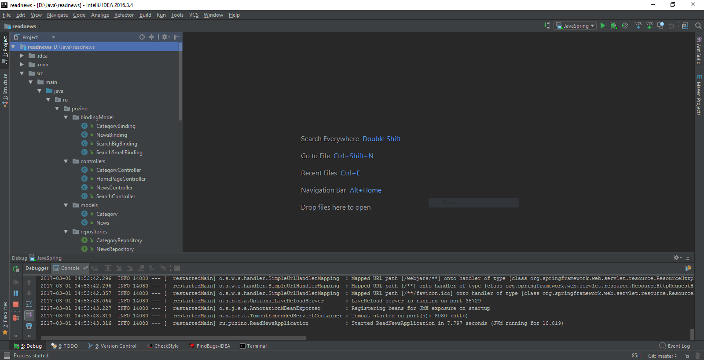
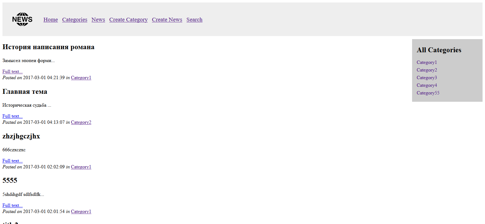
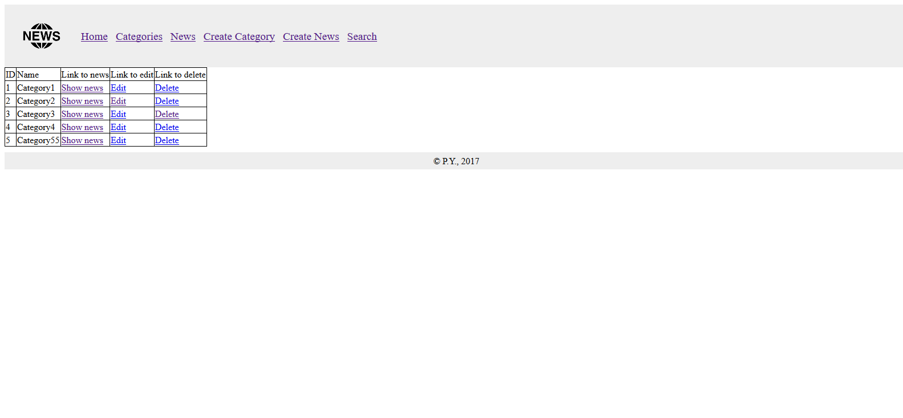
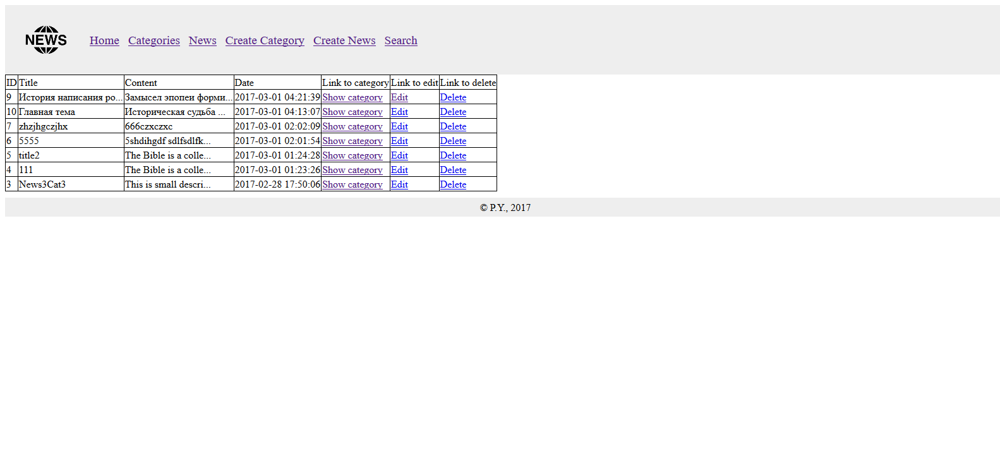
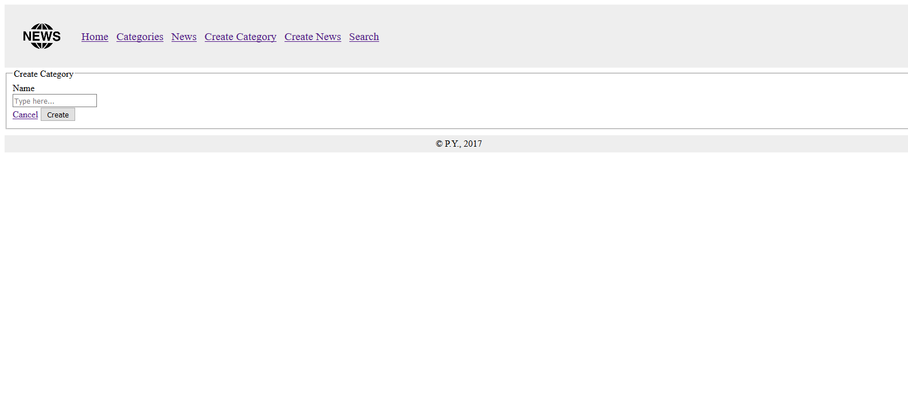
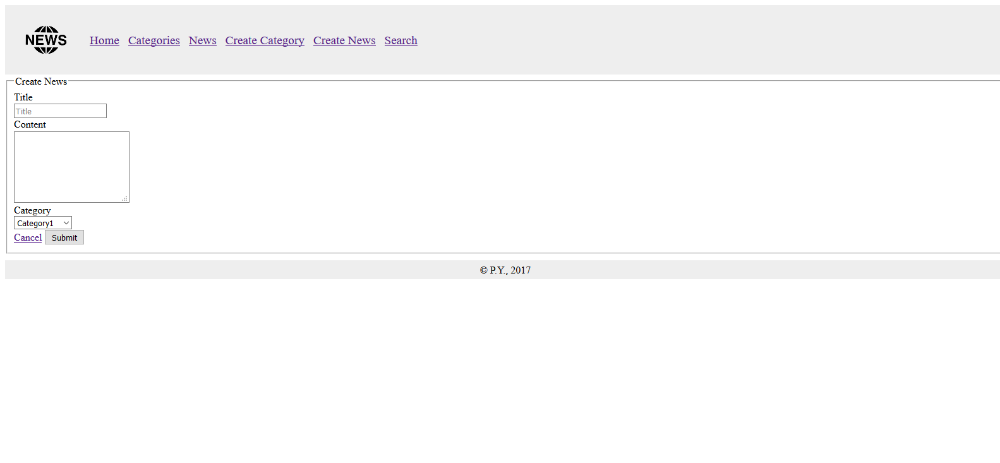
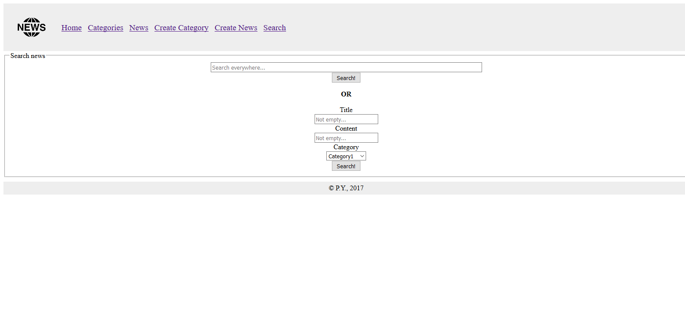

# ReadNews
Website with news and categories for them.

Develop web-application to manage news on site.

Each news contains title, content, date and category.

Each category contains name and could link with several news.

### Application must provide following:
* show news list;
* search by category (select from existing categories), title and content;
* news CRUD (create\edit\delete).

Need to implement: Java, Spring, Hibernate, Spring MVC. 

## Screenshots:

